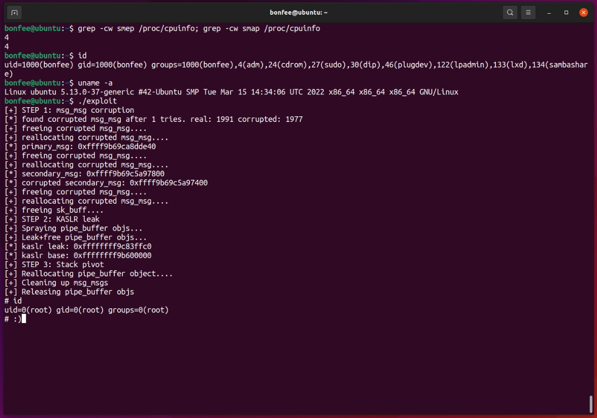

# CVE-2022-0995
This is my exploit for `CVE-2022-0995`, an heap out-of-bounds write in the watch_queue Linux kernel component.  
It uses the same technique described in https://google.github.io/security-research/pocs/linux/cve-2021-22555/writeup.html.  

The exploit targets Ubuntu 21.10 with kernel `5.13.0-37`.  
The exploit is not `100%` reliable, you may need to run it a couple of times.  It may panic the kernel, but during my tests it happened rarely.  
```sh
make
./exploit
```

